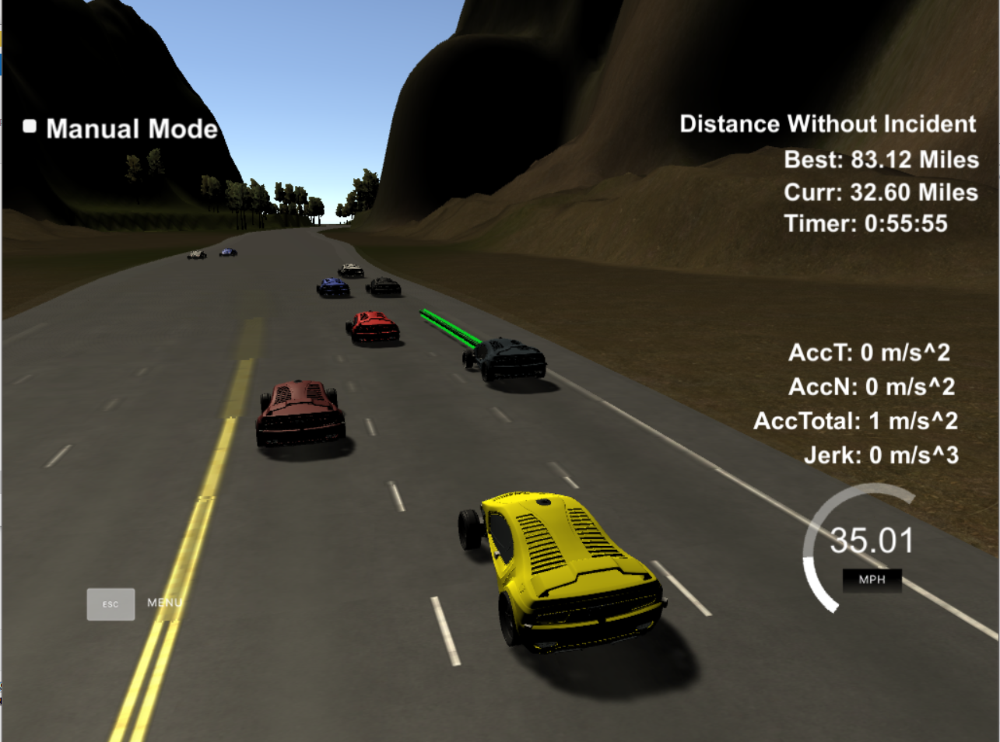

#  Path Planning Project

## Project Introduction
In this project, I implemented a path planner in C++ to navigate through traffic around a 6946m highway loop. The planner takes in current trajectory information (ex. position, speed, yaw) and "sensor fusion" data, which is the same trajectory information for surrounding cars.  It then determines the best trajectory based on the current and predicted states of all cars by using a cost function, which is tuned to avoid accidents and travel at the maximum safe speed.  It then generates a smooth trajectory for my car (aka. the "ego" car) using an open source [spline implementation](http://kluge.in-chemnitz.de/opensource/spline/).  In the project simulator, the result looks like this (video is at 3x speed due to gif size limitations):

<p align="center">
  
</p>

The green line represents the current planned trajectory for the car sent from the path planner logic to the simulator.  The speed limit is 50mph, so to avoid exceeding this, the target speed is set to 47mph.  As you can see, the car navigates traffic until it can drive at it's target speed again.  

Using my final planning logic, I was able to travel over 62 miles without incident.

### Goals
In this project the goal is to safely navigate around a virtual highway with other traffic that is driving +-10 MPH of the 50 MPH speed limit. You will be provided the car's localization and sensor fusion data, there is also a sparse map list of waypoints around the highway. The car should try to go as close as possible to the 50 MPH speed limit, which means passing slower traffic when possible, note that other cars will try to change lanes too. The car should avoid hitting other cars at all cost as well as driving inside of the marked road lanes at all times, unless going from one lane to another. The car should be able to make one complete loop around the 6946m highway. Since the car is trying to go 50 MPH, it should take a little over 5 minutes to complete 1 loop. Also the car should not experience total acceleration over 10 m/s^2 and jerk that is greater than 10 m/s^3.

## Implementation

Later I will walk through how I met each rubric requirement, but first, I will describe my overall solution in 3 parts: Prediction, Planning, and Trajectory Generation.

### Prediction

On a highway, vehicle prediction can be vastly simplified if one basic assumption is taken: All other vehicles are traveling at a constant speed. In practice (and even in the simulator it turned out), this is not actually true, but for the purposes of this exercise, it was reasonable trade-off as long as certain safety precautions are taken in the behavior planning phase.  With this assumption, to generate predictions, we simply take the position and speed of all vehicles found by sensor fusion, and decide how many points ahead to predict.  I chose only 1 second ahead of the current point.  The position of that point was calculated by simply adding the velocity to the previous position.  Prediction data is generated in `main.cpp` between lines 310-336.

### Behavior planning

The behavior planning logic is mostly contained in the `Vehicle` class (implemented in `vehicle.h\cpp`) and it's interaction with the cost functions in `cost.cpp`.  The initial logic\structure here was copied from the behavior planning lesson materials, and then significantly modified to fit this project.  The `Vehicle` class contains the state of the vehicle, it's current kinematics (position, speed, acceleration) and functions to update the state and kinematics based on it's current lane.  It also maintains a "Finite State Machine" with the following states: 

<p align="center">
  
</p>

The Vehicle class uses the cost functions in `cost.cpp` to determine when/if it should move to another state.  There are 4 costs considered:

| Cost            | Weight | Description |
|:---------------:|:-------:|:--------------------------------------------------------------:|
| Lane Change     |  10^4 | If lane is different than current lane, cost is 1, otherwise 0 |
| Efficiency      |  10^5 | Difference between lane speed and target speed                 |
| Lane Congestion |  10^5 | Amount of vehicles within twice the vehicle "buffer" (30m)     |
| Lane Danger     |  10^8 | How close we are to vehicles within "danger buffer" (10m)      |

Once a state is chosen, the planner uses this determine the desired lane, and desired speed.  The desired speed is either the target speed (which is set to 47mph to avoid exceeding the speed limit), or the speed that will cause us to keep the desired "buffer" (25m) from the car ahead in that lane. The desired lane and speed is sent to the trajectory generation.  

### Trajectory generation

The final (and what ended up being the most complex) part of the problem was generating smooth trajectories that did not exceed the maximum jerk or acceleration limits.  In main.cpp, you can find the trajectory generation logic.  The project materials described generation of "Jerk Minimizing Trajectories", but this involved a significant amount of complex vector math.  Instead, the project materials suggested using an open source [spline implementation](http://kluge.in-chemnitz.de/opensource/spline/), which generates a "spline" between a given set of points.  The Project Q&A session described a single spline approach for x/y values, and the basic idea here is what I used.  In short, I gather two previous points not used by the simulator in the last step as a starting point, then add 3 "horizon" points ahead.  I chose the horizon points to be at intervals of 45 meters as this lead to fairly smooth lane changes. 

This worked well for a constant speed, but generating a smooth acceleration using this method proved to be _extremely_ difficult, as the desired acceleration is along the [frenet](https://medium.com/@kastsiukavets.alena/highway-path-planning-696215cbf062) "s" vector.  Thus, I setup two splines, one that mapped s vs. x vals, and one mapping s vs. y values.  Then I could purely use the frenet s values to generate the desired trajectory, and use the splines to calculate the x/y values expected by the simulator.  To change lanes, I simply modified the frenet d value by the desired amount in the initial splines.  Trajectory generation is implemented in `main.cpp` between lines 355-491.

## [Rubric Points](https://review.udacity.com/#!/rubrics/1020/view)

Here I will consider the rubric points individually.

### Compilation

#### Build Instructions

1. Clone this repo.
2. Make a build directory: `mkdir build && cd build`
3. Compile: `cmake .. && make`
4. Run it: `./path_planning`.

##### Build Dependencies

* cmake >= 3.5
  * All OSes: [click here for installation instructions](https://cmake.org/install/)
* make >= 4.1
  * Linux: make is installed by default on most Linux distros
  * Mac: [install Xcode command line tools to get make](https://developer.apple.com/xcode/features/)
  * Windows: [Click here for installation instructions](http://gnuwin32.sourceforge.net/packages/make.htm)
* gcc/g++ >= 5.4
  * Linux: gcc / g++ is installed by default on most Linux distros
  * Mac: same deal as make - [install Xcode command line tools]((https://developer.apple.com/xcode/features/)
  * Windows: recommend using [MinGW](http://www.mingw.org/)
* [uWebSockets](https://github.com/uWebSockets/uWebSockets)
  * Run either `install-mac.sh` or `install-ubuntu.sh`.
  * If you install from source, checkout to commit `e94b6e1`, i.e.
    ```
    git clone https://github.com/uWebSockets/uWebSockets 
    cd uWebSockets
    git checkout e94b6e1
    
#### Simulator

You can download the Term3 Simulator which contains the Path Planning Project from [here](https://github.com/udacity/self-driving-car-sim/releases/tag/T3_v1.2).

### Valid Trajectories

#### The car is able to drive at least 4.32 miles without incident

This was easily achieved early on, but I wanted to see how far I could get. After all the tweaks I made (which will be described in more detail below), my longest run was was 62.49 miles:

<p align="center">
  
</p> 

#### The car drives according to the speed limit

I set my initial target speed to 49mph, but occasional latency in adjusting the acceleration sometimes caused the car to go beyond the speed limit.  Thus, I adjust the target speed back down to 47 mph to avoid ever exceeding the 50mph limit: 

<p align="center">
  
</p> 

#### The car stays in its lane, except for the time between changing lanes

Using the described trajectory generation along the provided map waypoints, this was fairly easy to achieve.  This should be evident in all the clips seen on this page.

Another aspect of this is the cost value I added for lane changes.  Although it is the smallest contributing factor in the equation, if all other costs are equal, the car will not change lanes.

#### The car is able to change lanes

This was achieved during trajectory generation by setting the "horizon" waypoints in the initial spline to be in the desired lane: 

This caused the lane change to occur before the first horizon point. 

<p align="center">
  
</p> 

By tuning the "cost" value of the efficiency metric (i.e. the difference between the current lane speed and the target lane speed), I was able to remain at the target speed most times.  This can be seen from the following screenshot, captured after 1 hour using my final parameters:

<p align="center">
  
</p>

As you can see, the average speed over that hour was just over 43 mph.  Before some of my final tweaks to increase overall safety (will be discussed in the "Car does not have collisions" section), my average speed over 1 hour was about 45.5 mph:

<p align="center">
  
</p>

Another way I could have improved the overall efficiency is by allowing the cost functions to examine lanes that are not directly adjacent.  Take, for example, the following clip:

<p align="center">
  
</p>

As you can see, my vehicle does not change lanes because there is a car in the danger buffer moving slightly slower in the next lane.  However, the far left lane is wide open.  If the ego car were to slow down, change lanes, and then do so again, it would be much further ahead.  I decided against this as I ultimately weighted safety over efficiency.  

#### Max Acceleration and Jerk are not Exceeded

After figuring out how to smoothly apply acceleration using the method described in the Trajectory Generation section, it was fairly simple to limit the total tangential acceleration. As the trajectory in the direction of the frenet s vector is exactly that.  I started with a maximum tangential acceleration of 6m/s^2, and later dropped it to 5m/s^2 (half the total maximum acceleration of 10m/s^2).  Since each point sent to simulator represents 0.02 seconds, this meant only adding/subtracting .1m/s (5 * .02) to the speed each point.  Due to the latency inherent in measuring desired vs. actual kinematics, there is a bit of deviation from the total.  You can see by viewing the initial acceleration from 0 that the tangential acceleration (i.e. AccT) is pretty consistent at 5 m/s^2, with a momentary jump to 6 m/s^2:

<p align="center">
  
</p>

Keeping this acceleration a constant also means the maximum tangential "jerk" (or change in acceleration) would be from 5m/s^2 to -5m/s^2, which would be 10 m/s^3.

Using the spline to generate smooth trajectories within lanes and for lane changes was generally enough to avoid high values of normal acceleration (i.e. "AccN").  However, there were a few situations that caused the normal acceleration to exceed the maximum 10 m/s^2 value.

The first thing I noticed was that the vehicle was sometimes making a rapid double lane change:

<p align="center">
  
</p>

This was caused by the vehicle quickly transitioning between the following states: Keep Lane -> Prepare Lane Change -> Lane Change -> Keep Lane -> Prepare Lane Change -> Lane Change.  To avoid such a rapid shift across lanes, I added a state after both of the Lane change states called "Lane Change Cool Down", and setup a "cool down" counter which I configured to 50 steps.  This forces the car to wait 50 steps before another lane change.  This resulted in the following improved behavior:

<p align="center">
  
</p>

The next thing I discovered was that the car began accelerating rapidly in the lane change state to reach the target speed of the new lane.  This caused up to a maximum of 5 m/s^2 tangential acceleration, which was then added to the normal acceleration of the lane change.  Thus, the combination of the two could often exceed the total maximum acceleration of 10 m/s^2.  To remedy this, I changed the acceleration for matching the new lane to happen in the "prepare lane change" state, and then forced the velocity to be constant for the actual "lane change" state. This removed a significant amount of tangential acceleration from the lane change equation.

The final thing I found was that occasionally, the total normal acceleration could still exceed 10 m/s^2 using the existing spline approach.  This only seemed to occur if there was some normal acceleration caused by a curve in the road, combined with a lane change in the same direction, all happening at relatively high speed.  Here are two captured examples

<div class="row">
  <div class="column">
    
  </div>
  <div class="column">
    
  </div>
</div>

After dropping my target tangential acceleration from 6m/s^2 to 5m/s^2, the frequency of these sharply dropped.  Also, my initial horizon value was 30 meters, and increasing this to 45 meters reduced the frequency of this even more, but did not completely eliminate them, especially at the exact point where the course went from completely straight to a turn.  I was unable to come up with a way to guarantee this wouldn't happen without refactoring my entire approach to trajectory generation.  I assume using the JMT approach may have resolved it, but it did not seem worth the trade-off in complexity as the above situations became quite rare after the tweaks noted above.  However, after all the tweaks that will be discussed in the "Car does not have collisions" section below, this actually was one of the most common "incidents" I continued to observe. 

#### Car does not have collisions

Collisions are avoided using 5 methods: 
1. Keep a specified follow distance using a configurable "buffer" (initially set to 25m).
2. Apply "emergency braking" (i.e. maximum deceleration) if a car enters the "danger" buffer (initially set to 8m).
3. Avoid unnecessary lane changes (see "The car stays in its lane" section above)
4. Avoid changing into "congested" lanes (i.e. lanes with more cars within the specified "buffer" than the current one, or cars approaching quickly from behind).
5. Never change into a lane with any cars in the danger buffer, or that will be within the danger buffer after 1 second. 

These methods are implemented throughout the behavior planning logic.  After the initial implementation, I examined the remaining collisions to improve my longest run without incident. 

The first collision type I noticed was the ego car inexplicably accelerating into the back of another car it was following:

<p align="center">
  
</p>


It took me a while to figure out why this phenomenon was occurring, but I noticed it happened at the exact same point on the track each time.  After debugging, I discovered it happened when reaching the end of the loop, causing the frenet "s" values to wrap back to 0.  This caused the difference between the car ahead and the ego car to be greater than 6000m, so the ego car accelerated, seeing nothing in its way until it was too late.  Since the cars that showed up in sensor fusion had a limit much smaller than 6000m, I added some logic that would correct for s value differences larger than 6000 by adding/subtracting the total track length from the s values in my prediction set.  That resolved this problem.

The next collision types were more complex.  Most of them involved other vehicles _not_ moving at a constant speed, which was an assumption in predictions I took from the start.  Again, I was unable to avoid them entirely without major refactoring (ex. trying to calculate an acceleration value for the non-ego cars by keeping a history) but, they did lead to some fixes and tweaks in my planning logic.  Let's examine 4 captured collision clips:

##### Lane change collision type 1
<p align="center">
  
</p>

In this clip, the red car behind in the target lane briefly slows down, making it and it's predicted next state outside the danger buffer.  The ego car decides on a lane change, and then the car behind speeds up again, colliding with mine.  Since my lane choice was made before the other car's speed indicated it would collide with mine, there was no way to forsee the collision.   I increased the "danger buffer" from 8m to 10m to help avoid this in the future.

##### Lane change collision type 2
<p align="center">
  
</p>

The car ahead in white slams on its breaks (likely exceeding my maximum allowable deceleration).  My cost function now determines the distance to the car ahead is shorter than it would be in the next lane, so it tries to avoid the collision by switching to the next lane.  A real driver may have slammed on its own brakes, but since this also trips the "incident" trigger for deceleration, I'm not sure my planner could have made a better choice given its follow distance.  It did appear though that the follow distance seemed closer than it should have been, and I discovered a bug in my follow speed calculation that was causing me to match the vehicle speed ahead instead of keeping the required follow distance.  After this, I still noticed similar incidents during other close follow scenarios, so I increased my follow buffer to 30m for safety. 

##### Lane change collision type 3
<p align="center">
  
</p>

This clip exposed a flaw in my decision making.  Before the lane change, the white car briefly slows down, causing the "congestion" of that lane to be less than the ego car's current lane, and the white car to drop out of the "danger buffer" as it's speed is suspected to be constant.  This triggers a lane change.  Then the red car ahead slows slightly, causing the ego car to enter the danger buffer, which then triggers the emergency braking, causing the car behind to hit the ego car.  The next clip is similar:

<p align="center">
  
</p>

The ego car finds a faster lane, the car in the next lane brakes, the ego car applies emergency braking, and the car behind collides with it.  To account for this, I modified my danger _cost_ to look for cars in twice the danger buffer (i.e. 20m), while still only applying emergency braking within 10m.   Thus, the ego car should avoid lane changes if cars are within 20m, which means it should rarely need to apply emergency braking after a lane change.  

I did not observe these types of incidents after all these tweaks.  However, as noted in the "The car is able to change lanes," this impacted my overall efficiency (dropping my average speed from 45.5mph to 43.2mph over 1 hour of measurement).  This, however, seemed like a worthwhile trade-off.

The remaining collisions I observed typically felt outside of my control, like cars side swiping me, or rapid deceleration without a chance to change lanes to avoid it.  

### Reflection

